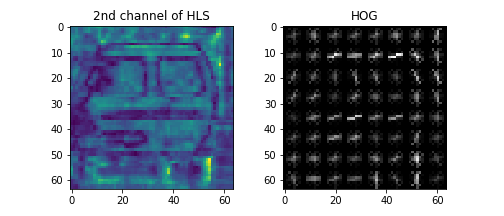

## P5 Vehicle Detection Report
### Author: Hsin-Cheng Chao (olala7846@gmail.com)
---

**Vehicle Detection Project**

The goals / steps of this project are the following:

* Perform a Histogram of Oriented Gradients (HOG) feature extraction on a labeled training set of images and train a classifier Linear SVM classifier
* Optionally, you can also apply a color transform and append binned color features, as well as histograms of color, to your HOG feature vector.
* Note: for those first two steps don't forget to normalize your features and randomize a selection for training and testing.
* Implement a sliding-window technique and use your trained classifier to search for vehicles in images.
* Run your pipeline on a video stream (start with the test_video.mp4 and later implement on full project_video.mp4) and create a heat map of recurring detections frame by frame to reject outliers and follow detected vehicles.
* Estimate a bounding box for vehicles detected.


## [Rubric](https://review.udacity.com/#!/rubrics/513/view) Points
### Here I will consider the rubric points individually and describe how I addressed each point in my implementation.

---
### Writeup / README

#### 1. Provide a Writeup / README that includes all the rubric points and how you addressed each one.
You're reading it!

### Histogram of Oriented Gradients (HOG)

#### 1. Explain how (and identify where in your code) you extracted HOG features from the training images.

(The code is at the 5th cell of [Classifier.ipynb](./Classifier.ipynb))

I started by reading in all the `vehicle` and `non-vehicle` images using `glob` library and extract HOG features using `hog` function from `skimage.features`. Then explored different color spaces and different `skimage.hog()` parameters (`orientations`, `pixels_per_cell`, and `cells_per_block`).  I grabbed random images from each of the two classes and displayed them to get a feel for what the `skimage.hog()` output looks like.

Here is an example using the `YCrCb` color space and HOG parameters of `orientations=8`, `pixels_per_cell=(8, 8)` and `cells_per_block=(2, 2)`:





#### 2. Explain how you settled on your final choice of HOG parameters.

I tried to train SVM classifier using only HOG features across different color spaces and different parameters.


##### Results on different combinations
**(orient, pixelc per cell, cells per block)**

| Color space | (9, 8, 1) | (9, 8, 2) | (9, 8, 3) | (12, 8, 1) |
|-------------|----------|-----------|----------|----------|
| HLS | 0.9747 | 0.9811 | 0.9775 | 0.9820 |
| RGB | 0.9459 | 0.9682 | 0.9724 | 0.9851 |
| Luv | 0.9800 | 0.9806 | 0.9859 | 0.9845 |
| YCrCb | 0.9831 | 0.9876 | 0.9865 | 0.9865 |
| YUV | 0.9809 | 0.9890 | 0.9873 | 0.9882 |
| Lab | 0.9809 | 0.9848 | 0.9851 | 0.9392 |

The result looks best at `2 cells per block` and `YUV` and `YCrCb` seems to be the best color space to train a classifier with.


#### 3. Describe how (and identify where in your code) you trained a classifier using your selected HOG features (and color features if you used them).

First I did a shuffle train test split on all image data (8793 vehicles and 8968 non-vehicles) using sklearn `train_test_split`, then I normalize the features using sklearn `StandardScaler`. I did a grid search on all color spaces (RGB, HLS, Luv, YCrCb, YUV, Lab) and different cells per block (1, 2, 3) and pick the combination of parameters results in the best accuracy as discuss above.

The code is at the 8th code cell in the `Classifier.ipynb`

### Sliding Window Search

#### 1. Describe how (and identify where in your code) you implemented a sliding window search.  How did you decide what scales to search and how much to overlap windows?

TODO(Olala): identify where's the code
The window search is defined as the `find_car` function in the 3rd code cell of `SlidingWindow.ipynb`.
After some trail and error, I decided to search wth window for 4 different scales

```
# ystart, ystop, scale, cells_per_step, color
searches = [
    (380, 500, 1.0, 1, (0, 0, 255)),  # 64x64
    (400, 600, 1.587, 2, (0, 255, 0)), # 101x101
    (400, 710, 2.52, 2, (255, 0, 0)),  # 161x161
    (400, 720, 4.0, 2, (255, 255, 0)), # 256x256
]
```

#### 2. Show some examples of test images to demonstrate how your pipeline is working.  What did you do to optimize the performance of your classifier?

To get the best accuracy, I decide to use not only the HOG features and also the color histogram and spatial bin features. I also tried on different number of histogram bins and different spatial bin resolutions to get the best result and reduce number of features required.

##### Results of accuracy on differe nbins

| Color space | 256 | 128 | 64 | 32 | 16|
|-----|--------|--------|------|------|------|
| HLS | 0.9561 | 0.9659 | 0.96 | 0.95 | 0.93 |
| RGB | 0.9150 | 0.9223 | 0.92 | 0.91 | 0.89 |
| Luv | 0.9271 | 0.9398 | 0.93 | 0.91 | 0.90 |
| YCr | 0.9414 | 0.9440 | 0.93 | 0.92 | 0.89 |
| YUV | 0.9378 | 0.9324 | 0.92 | 0.91 | 0.88 |
| Lab | 0.9513 | 0.9513 | 0.95 | 0.94 | 0.90 |

128 bins does the best job

##### Different size of spatial bin

| Color space | 16x16 | 32x32 | 64x64 |
|-----|------|------|------|
| HLS | 0.91 | 0.88 | 0.87 |
| RGB | 0.92 | 0.91 | 0.90 |
| Luv | 0.92 | 0.89 | 0.89 |
| YCr | 0.92 | 0.91 | 0.90 |
| YUV | 0.91 | 0.90 | 0.90 |
| Lab | 0.93 | 0.92 | 0.90 |

##### Results combining HOG, color histogram, spatial bin

| Color space | Feature extraction (sec) | Training time (sec) | Predict Time (sec) | Accuracy |
|-------|-------|-------|-------|-------|
| HLS | 63.47 | 19.83 | 0.14 | 0.9930 |
| Lab | 68.27 | 5.93 | 0.13 | 0.9932 |
| YCrCb | 67.36 | 7.53 | 0.57 | 0.9910 |
| Luv | 68.92 | 5.86 | 0.42 | 0.9924 |
| YUV | 68.31 | 18.21 | 0.56 | 0.9932 |
| RGB | 67.82 | 21.92 | 0.58 | 0.9879 |


Ultimately combined all three features (HOG, color histogram, spatial bin) and get a pretty good accuracy except RGB.

To increase the performance of my classifier I did the following things.

1. Only extract features in the region of interested (bottom half of image)
2. Convert color space and extract HOG features only once before applying the sliding window cut to reduce unnecessary calculations.


---

### Video Implementation

#### 1. Provide a link to your final video output.  Your pipeline should perform reasonably well on the entire project video (somewhat wobbly or unstable bounding boxes are ok as long as you are identifying the vehicles most of the time with minimal false positives.)

Here's a [link to my video](https://youtu.be/3Xq27UI-I-U)


#### 2. Describe how (and identify where in your code) you implemented some kind of filter for false positives and some method for combining overlapping bounding boxes.

I recorded the positions of positive detection window in each frame of the video. From the positive detections I created a heatmap and then thresholded that map to identify vehicle positions. To get a more robost result, I use a `deque` to record the heatmap of last 10 frames  and sum the in a exponential decay fashion before applying the threshold.
then I apply a threshold to the final heatmap and use used `scipy.ndimage.measurements.label()` to identify individual blobs in the heatmap.  I then assumed each blob corresponded to a vehicle.  I constructed bounding boxes to cover the area of each blob detected.

(code in the 5th code cell of `SlidingWindow.ipynb`)

### Here a image of sliding window of 4 different scales (with one false positive)

### Here a image of heatmap and the result detection bounding boxes


---

### Discussion

#### 1. Briefly discuss any problems / issues you faced in your implementation of this project.  Where will your pipeline likely fail?  What could you do to make it more robust?

When I finished traind my classifier, I thought the accuracy was good enough (0.99). But after applying onto the road video frames, I soon recignized that 99% just ins't good enough, since we are scanning so many windows per frame, it is almost impossible to not have any false positive result.

I tried to sum up the last few frames and average them to get a better heatmap result, though generally it makes the result more stable, but still in some cases there will be some false positive strong enough to survice even after averaging the heatmapm making the false positive doesn't disappers but appears longer! (for 5 frames). So I came up with a exponential decay manner to sum the heatmap and the result is quite promissing.

Though my pipeline looks quite good on the project video, but some parameters (e.g. sliding window size and range, color space, frames to keep) are hand picked and may be kind of overffited to this video. So I might fail in othere cases like cloudy days or at night. Also I used the last 10 frames to get a robost vehicle detection, so it might not be able to dealt with quick approaching vehicles.

One possible way to make my pipeline more robost is to get a better classifier by adding more training data on different cases (night, rain, shadow ... etc) or use other classifier like CNN.
